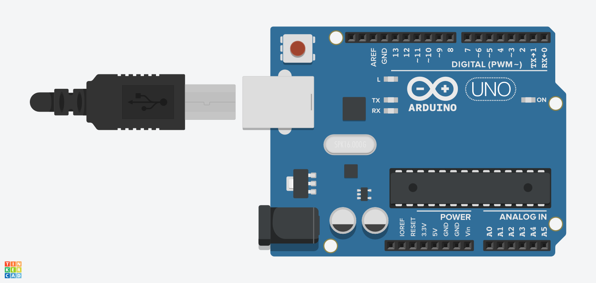
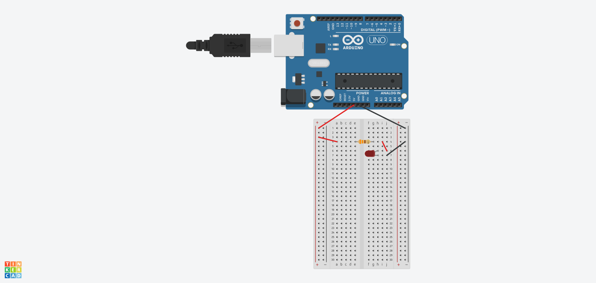

# ArduinoJour1

## Job 01

Power supply our Arduino



## Job 02

> To calculate the resistor to use with a red LED connected to an Arduino, one must take into account the supply voltage of the Arduino, the direct voltage of the LED and the maximum current admissible by the LED.

The forward voltage of a red LED is about 2 volts and the maximum allowable current can vary but is usually about 20 milliamps (mA).



Suppose we are using a 5 volt power supply for our Arduino. To calculate the resistance needed for the red LED, we can use Ohm's law:

```
R = (V_alim - V_LED) / I_LED
R = (5 V - 2 V) / 0,01 A = 300 ohms
E12 R series = 330 ohms
```

## Job 03

We haven't restrictions on wire method, so we use the LED in serie just like so:


## Job 04

> When connecting LEDs in series, you must take into account the forward voltage of each LED, the supply voltage and the current you want to pass through the circuit.

To calculate the resistance needed for a series of red LEDs, one must use Ohm's law:

```
R = (V_alim - (n x V_LED)) / I_LED
```

## Job 05

> To calculate the resistance needed for each LED in parallel, we must use the same formula that we used previously for a single LED, simply replacing I_LED by the sum of the currents of all the LEDs we connect in parallel.

For example, to connect two red LEDs in parallel to a 5 volt supply with a maximum current of 10 milliamps each, one can calculate the resistance needed for each LED as follows:

```
R = (V_alim - V_LED) / (I_LED + I_LED)
R = (5 V - 2 V) / (0,01 A + 0,01 A) = 150 ohms
E12 R series = 330 ohms x 2 in parallel
```

Once done, we have this circuit:


## Job 09 

We have this assembly for this job:


